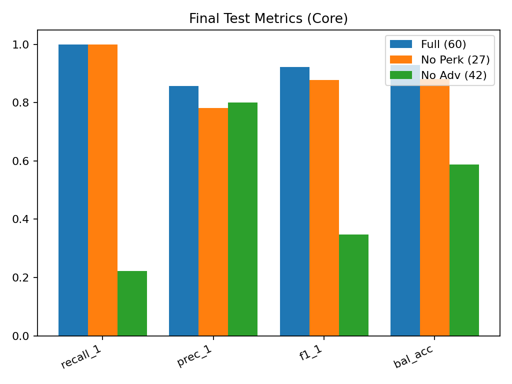
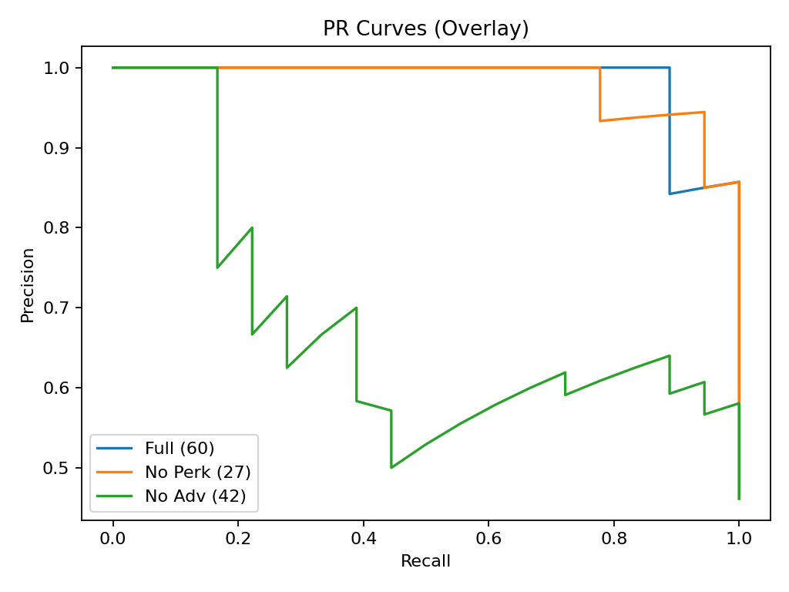
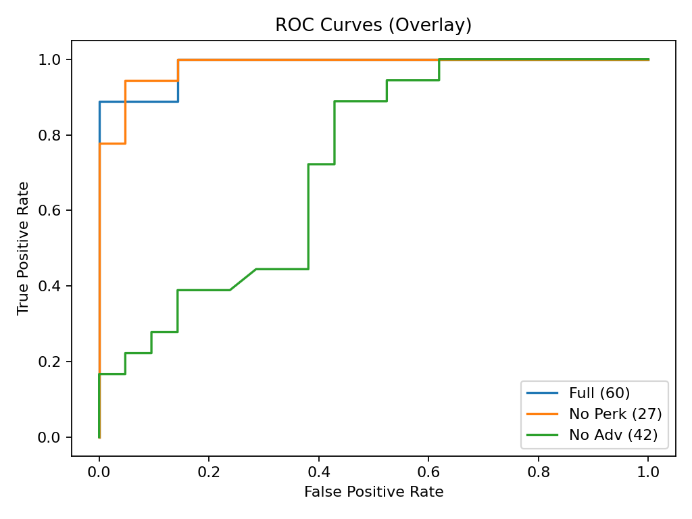
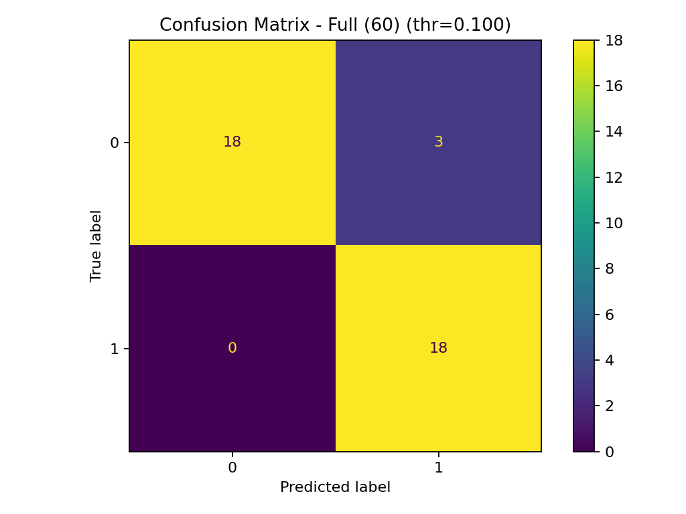
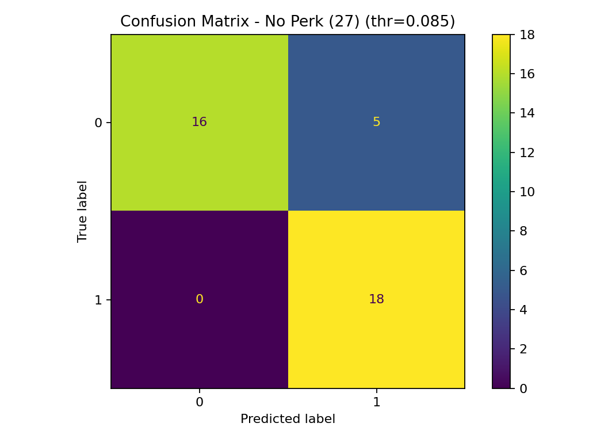
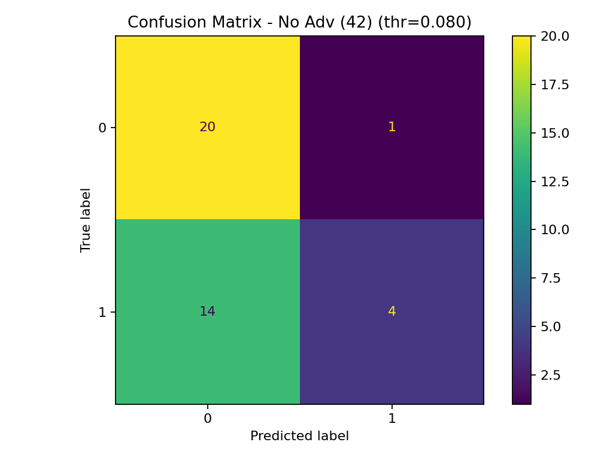
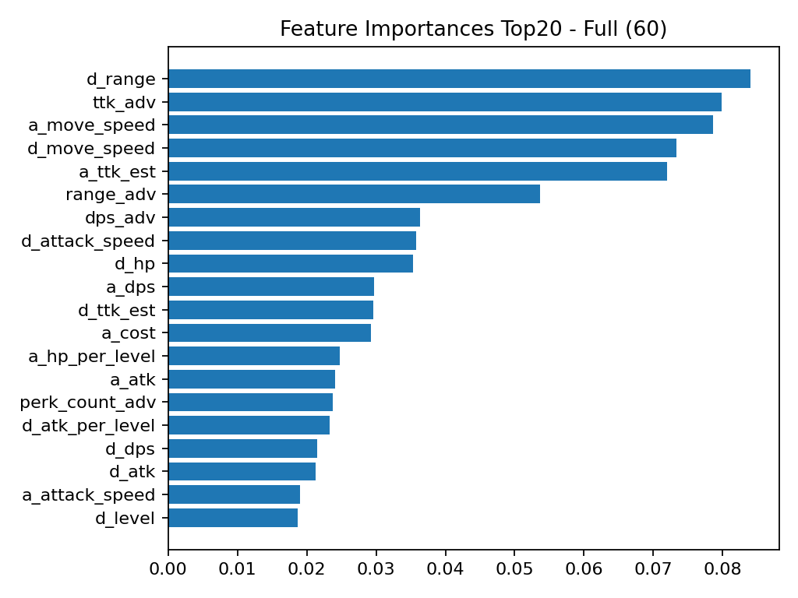
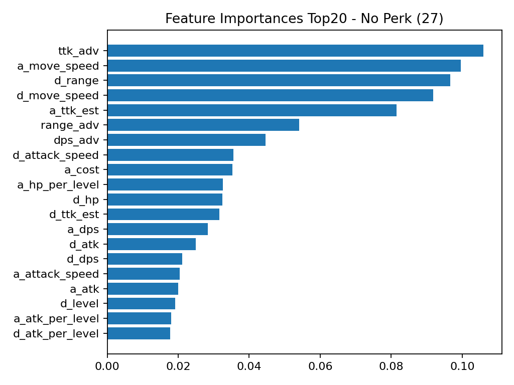
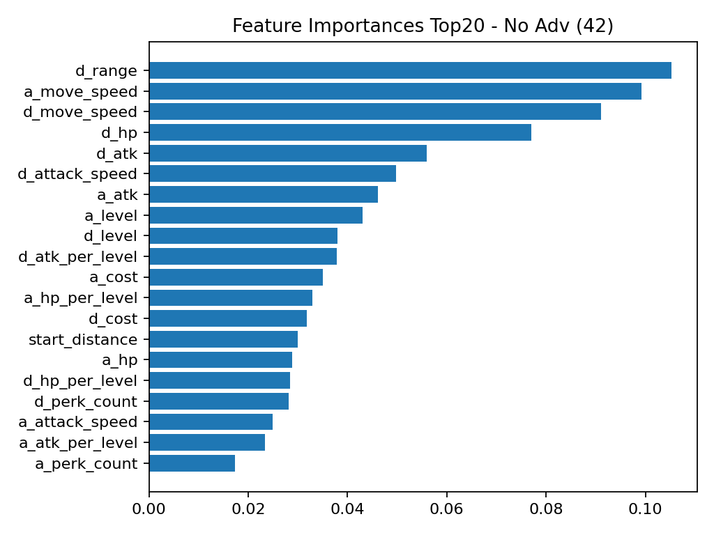

# Portfolio Visuals — 2025-12-31 Baseline (RF, Recall-tuned)

## What this shows
- Same dataset / same split policy (group split, overlap dropped)
- Same model family (RandomForest, class_weight=balanced)
- Threshold tuned for **recall**
- Ablation study:
  - **Full**: all features
  - **No Perk**: perk features removed
  - **No Adv**: derived/adv features removed (DPS/TTK/adv)

## Key Figures
### Core metric comparison

### PR / ROC

### Confusion matrices
- Full: 
- No Perk: 
- No Adv: 

### Feature importance (Top20)
- Full: 
- No Perk: 
- No Adv: 

## Artifacts
- metrics summary: `metrics_summary.csv`
- per-run predictions: `preds_*.csv`
- error cases: `errors_*_(FN/FP)_topN.csv`
