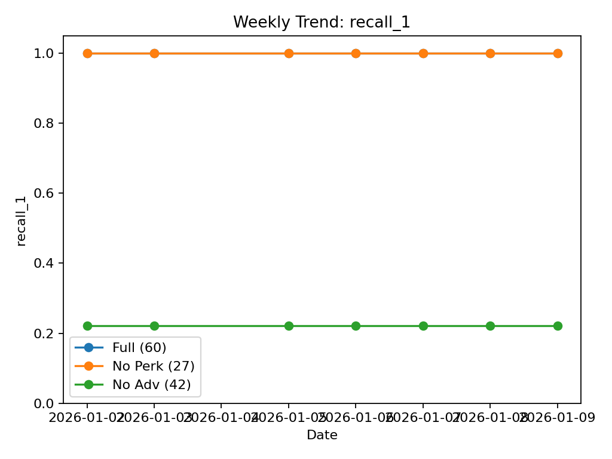
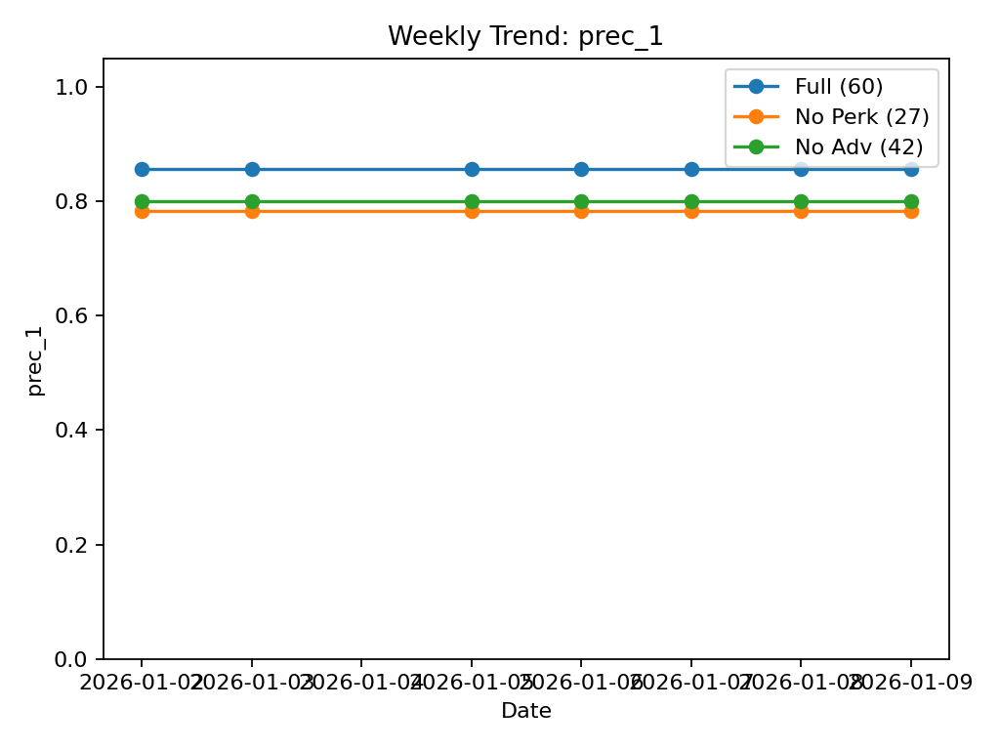
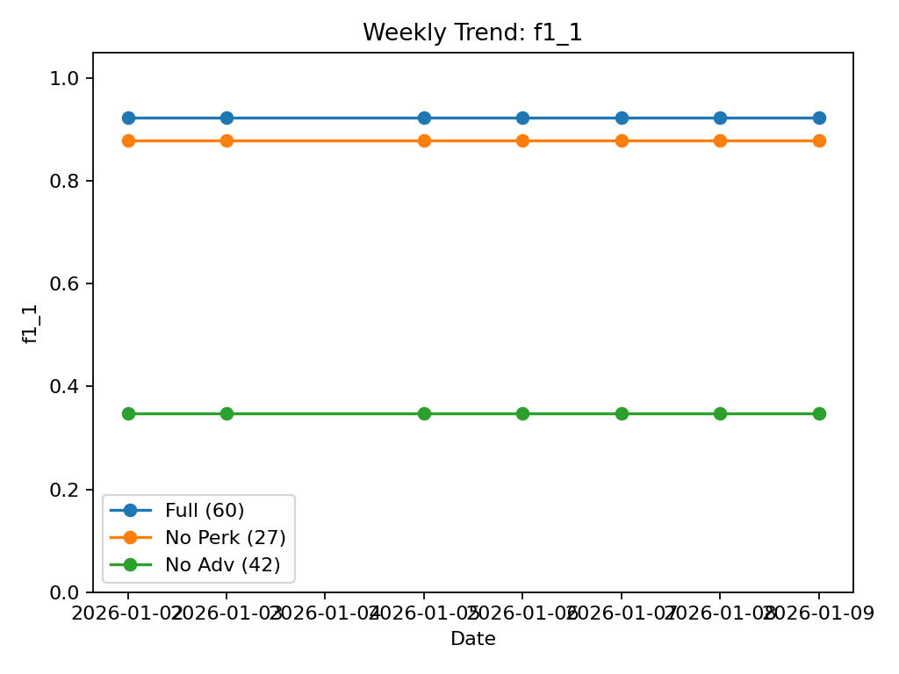
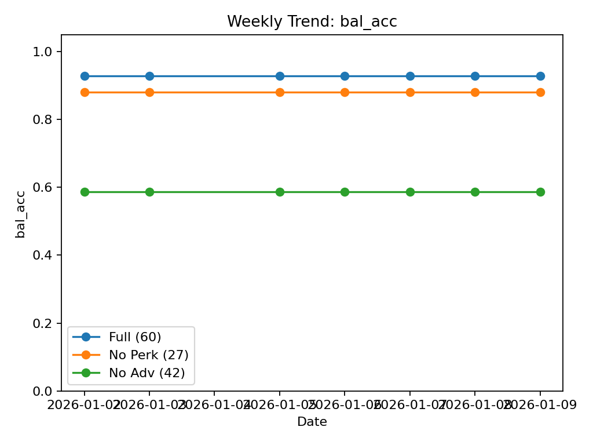

# Weekly Portfolio Report (20260102 ~ 20260109)

## What this shows
- Daily baseline snapshots aggregated into a weekly trend report
- Compare ablations across time: Full / No Perk / No Adv
- Focus on recall-tuned threshold setting

## Key Trend Plots

## CSV Artifacts
- `weekly_metrics_long.csv` : raw concatenation (date, run, metrics)
- `weekly_metrics_pivot.csv`: pivot table (date x run)
- `weekly_metrics_summary.csv`: mean/std by run
